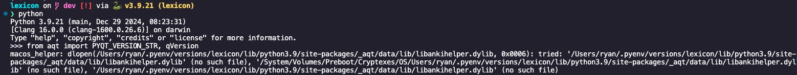

Anki add-on to create flash cards

### getting-started
```
pyenv install 3.9
pyenv virtualenv 3.9 lexicon
pyenv activate lexicon
pip install requirements/requirements-dev.txt
```


### anki-debugging

#### add-python-debug-breakpoint
```python
import pdb; pdb.set_trace();

```

#### anki-debug-in-terminal
Run the following from a terminal
```bash
/Applications/Anki.app/Contents/MacOS/anki
```


### run-a-terminal-inside-anki
- inside anki
```shell
cmd+shift+;
```
[debug-documentation](https://docs.ankiweb.net/misc.html#debug-console)


### addon-directory-overview
- [config.json](addon/config.json) = configuration that users can set within the anki user interface
- [manifest.json](addon/manifest.json) = for distributing anki addons outside of anki web


### viewing-anki-versions
- The version of the aqt library used in the anki application can be found by clicking on Anki -> About Anki


- Version should correspond to the `aqt` version in [requirements/requirements-dev.in](requirements/requirements-dev.in)
- Check the pyqt version locally from an interpreter
```python
from aqt import PYQT_VERSION_STR, qVersion
print(PYQT_VERSION_STR) #PyQt version
print(qVersion()) #qt version
```
- The latest dependencies that aqt uses can be found [here](https://github.com/ankitects/anki/tree/main/python)

# missing libankihelper.dylib file
If you received the following error, this means that the `libankihelper.dylib` dynamic library calling some of the C++ code for Qt was not included in the PIP install:



1) Download the Anki app for [your platform here](https://apps.ankiweb.net/)
2) The libankihelper.dylib file should be available from here, if you installed the .dmg to `/Applications`
```
/Applications/Anki.app/Contents/MacOS/libankihelper.dylib
```
3) Copy the file into your virtual environment
```sh
mkdir ~/.pyenv/versions/lexicon/lib/python3.9/site-packages/_aqt/data/lib/

cp /Applications/Anki.app/Contents/MacOS/libankihelper.dylib \
~/.pyenv/versions/lexicon/lib/python3.9/site-packages/_aqt/data/lib/
```
