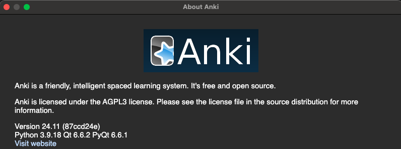

Anki add-on to create flash cards

### getting-started
```
pyenv install 3.9
pyenv virtualenv 3.9 lexicon
pyenv activate lexicon
pip install requirements/requirements-dev.txt
```


### anki-debugging

#### add-python-debug-breakpoint
```python
import pdb; pdb.set_trace();

```

#### anki-debug-in-terminal
Run the following from a terminal
```bash
/Applications/Anki.app/Contents/MacOS/anki
```


### run-a-terminal-inside-anki
- inside anki
```shell
cmd+shift+;
```
[debug-documentation](https://docs.ankiweb.net/misc.html#debug-console)


### addon-directory-overview
- [config.json](addon/config.json) = configuration that users can set within the anki user interface
- [manifest.json](addon/manifest.json) = for distributing anki addons outside of anki web


### viewing-anki-versions
- The version of the aqt library used in the anki application can be found by clicking on Anki -> About Anki 
- Version should correspond to the `aqt` version in [requirements/requirements-prod.in](requirements/requirements-prod.in)
- Check the pyqt version locally from an interpreter
```python
from aqt import PYQT_VERSION_STR, qVersion
print(PYQT_VERSION_STR) #
```